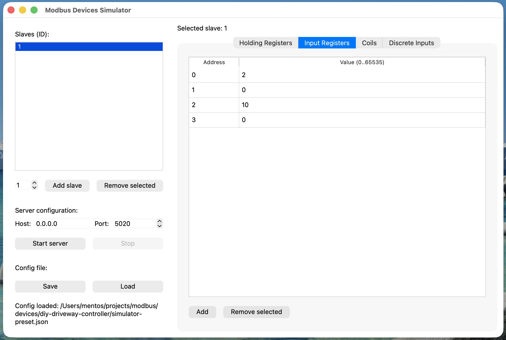

# modbus-devices-simulator

A GUI Modbus TCP simulator with support for multiple slaves simultaneously. Allows real-time editing of registers (Holding, Input, Coils, Discrete Inputs) and saving/loading configuration to a JSON file.



## Requirements

- Python 3.13+
- PySide6
- pyModbusTCP

## First run

```bash
# Create virtual environment
python3 -m venv .venv

# Activate
source .venv/bin/activate

# Install dependencies
pip install -r requirements.txt
```

## Translations

The UI language is detected automatically from the system locale. A compiled translation file for Polish is included. To recompile after editing `translations/pl_PL.ts`:

```bash
pyside6-lrelease translations/pl_PL.ts -qm translations/pl_PL.qm
```

To add a new language, create `translations/<locale>.ts` and compile it the same way.

## Running

```bash
source .venv/bin/activate

# Default config (config.json in the script directory)
python modbus_gui.py

# Alternative config (preset)
python modbus_gui.py --config path/to/preset.json

# Debug mode — every Modbus request logged to terminal
python modbus_gui.py --debug
python modbus_gui.py --config path/to/preset.json --debug
```

On startup, the terminal will show which config file is being used:
```
[config] Config file: /path/to/config.json
[config] Loaded: /path/to/config.json
```

Example output in `--debug` mode:
```
[modbus] read_input_registers    slave=1 addr=0 count=4 -> [0, 500, 12000, 0]
[modbus] read_coils              slave=1 addr=0 count=1 -> [False]
[modbus] write_coils             slave=1 addr=0 values=[True]
```

## Features

- Add and remove slaves (ID 0–247)
- Edit Holding Registers, Input Registers, Coils, Discrete Inputs
- TCP server on any host and port (default `0.0.0.0:5020`)
- Automatic GUI ↔ server synchronization every 200/500ms
- Save and load configuration from a JSON file
- On close: save / discard changes / cancel dialog — safe for presets
- Multiple presets support via `--config`
- `--debug` mode logging every Modbus request to terminal

## Testing with pymodbus REPL

```bash
pymodbus.console tcp --host 127.0.0.1 --port 5020
```

Basic commands:
```
client.read_holding_registers address=0 count=10 slave=1
client.write_register address=0 value=123 slave=1
client.read_coils address=0 count=8 slave=1
client.write_coil address=0 value=True slave=1
```
